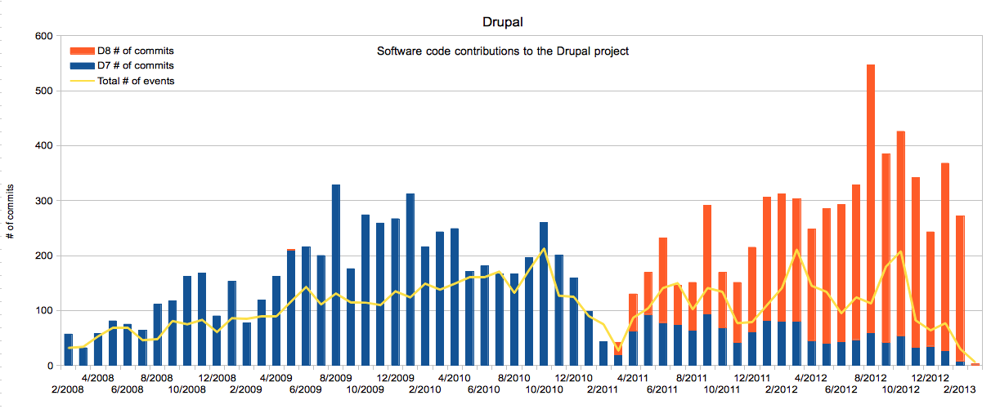
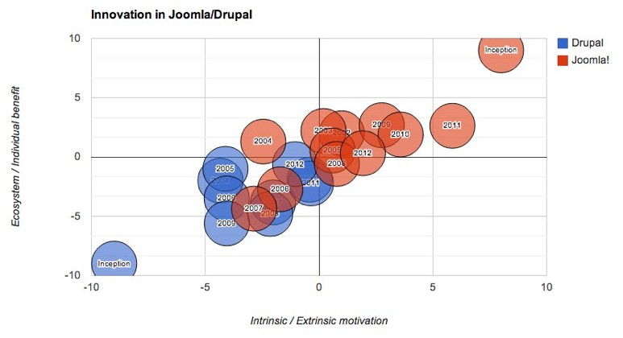

This paper details how open source software (OSS) development communities maintain an ecosystem
conducive to constant innovation from its contributing members. We posit that successful open source
communities develop a healthy balance of motivation through intrinsic and extrinsic means, along with a
strong sense of culture, and supportive governance. Boundary organizations maintain these community
attributes providing a foundational support structure, thus fostering the environment for innovation. This
paper analyzes the actions within two leading open source projects, Drupal and Joomla (which collectively
power millions of websites), that gave rise to healthy ecosystems of innovation.

Drawing on the work of Shah (2006), O’Mahony and Bechky (2008), and others complemented by interview
data with founders and lead developers of the Drupal and Joomla projects, we seek to understand the pivots
and turns in the projects that have led to high levels of innovation and the role of boundary organizations. The
boundary organizations play several important functions: 

1.   Support infrastructure that allows project leads to
hand off repeatable processes to the boundary organization thus reducing their burden and providing
increased opportunity to focus on the development of the project
2.   Maintenance of incentive systems that
reflect, actively cultivate, and perpetuate the ideals of the community 
3.   A collective gathering point for
project leads to provide guidance on the culture and ethos of the community to maintain motivation.

Preliminary research has demonstrated that the boundary organizations engage in direct and indirect activities
that seek to strike a balance between intrinsic and extrinsic motivations in their respective communities.
Although both the Joomla and Drupal projects started out with different motivations, over time the projects
have trended towards each other in motivational balance [Figure 1]. This research looks at the correlations
between the events and actions undertaken through the boundary organizations to understand their role and
importance in maintaining balance in the community [Figure 2].

Through personal interviews, survey data, and analysis of quantitative data of code contributions, attendance
at events, and actions undertaken by boundary organizations and project leads we attempt to paint a historical
picture of the rise of these communities thus providing a blueprint to the practicing manager on the cultivation
and maintenance of their innovation ecosystem.

*Figure 1*: Demonstrates a progression of each project towards a balance of motivations.

*Figure 2*: Contributions to the Drupal project follow event activity in the ecosystem often brokered by the boundary
organization.

## References
Shah, Sonali (2006). “Motivation, Governance, and the Viability of Hybrid Forms in Open Source Software
Development,” Management Science, 52(7): 1000-1014.

O’Mahony, Siobhán and Beth A. Bechky (2008). “Boundary Organizations: Enabling Collaboration among Unexpected
Allies,” Administrative Science Quarterly, 53: 422-459.

[Download the PDF](research/docs/SMS_Fostering_Resilient_Innovation_Handout.pdf "Download the PDF")
